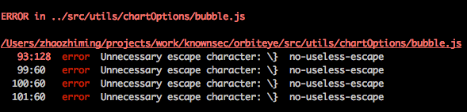

当你使用generator创建项目之后，就可以开始开发你的Web应用，下面是本项目框架的一个使用指南，可以指导你如何使用框架开发新功能。  
  
## 目录
  
* [目录结构](#目录结构)
* [操作命令](#操作命令)
    * [npm start](#npm-start)
    * [npm run start:dist](#npm-run-startdist)
    * [npm test](#npm-test)
    * [npm run check](#npm-run-check)
    * [npm run dist](#npm-run-dist)
* [静态代码检查](#静态代码检查)
    * [JS代码检查](#JS代码检查)
    * [CSS代码检查](#CSS代码检查)
* [安装依赖](#安装依赖)
* [导入组件](#导入组件)
* [添加样式](#添加样式)
* [CSS预处理](#CSS预处理)
* [添加图片和字体](#添加图片和字体)
* [使用And Design](#使用and-design)
* [编写action](#编写action)
* [编写reducer](#编写reducer)
* [发送请求](#发送请求)
* [集成服务端](#集成服务端)
* [编写测试](#编写测试)
    * [编写reducer测试](#编写reducer测试)
    * [编写组件测试](#编写组件测试)
* [项目部署](#项目部署)
    * [前端项目部署](#前端项目部署)
    * [后端项目部署](#后端项目部署)


## 目录结构

```
├── .babelrc
├── .eslintrc
├── package.json
├── devServer.js
├── docs
│   └── README.md
├── src
│   ├── app.js
│   ├── components
│   │   └── Name
│   │       ├── Name.js
│   │       ├── index.js
│   │       └── style.css
│   ├── constants
│   │   └── actionTypes.js
│   ├── containers
│   │   └── Main
│   │       ├── Main.js
│   │       ├── actions.js
│   │       ├── components
│   │       │   └── Message
│   │       │       ├── Message.js
│   │       │       ├── index.js
│   │       │       └── style.css
│   │       ├── index.js
│   │       ├── reducer.js
│   │       └── style.css
│   ├── reducers.js
│   ├── routes.js
│   ├── server
│   │   ├── README.md
│   │   └── index.js
│   ├── store.js
│   ├── styles
│   │   └── App.css
│   └── utils
│       └── README.md
├── test
│   ├── containers
│   │   └── Main
│   │       ├── components
│   │       │   └── Message
│   │       │       └── Message.test.js
│   │       └── reducer.test.js
│   ├── css-null-compiler.js
│   ├── dom.js
│   └── macha.opts
├── validate-commit-msg.js
└── webpack
    ├── base.js
    ├── client.js
    └── server.js
```

## 操作命令
在项目中，你可以运行如下命令：  

### `npm start`

在开发环境运行项目，启动成功后，在浏览器打开http://localhost:8000可以访问。  

当你修改项目中的文件并保存后，后台会重新加载，如果有错误会在终端显示。

### `npm run start:dist`

在生产环境运行打包后的项目，整体性能比开发环境更快。

### `npm test`

运行项目中的测试，你可以查看[编写测试](#编写测试)章节了解如何编写测试用例。  

### `npm run check`

运行代码检查，发现你的代码是否有错误，检查内容包括JS和CSS文件，你可以查看[静态代码检查](#静态代码检查)章节了解更多内容。

### `npm run dist`

运行打包程序，将项目打包为静态资源文件。

## 静态代码检查

项目中集成了一些JS和CSS编码规范，这些规范是业界推崇比较好的规范，这样可以统一开发团队的编码规范，避免杂乱无章的代码。  

如果你的代码不符合这些规范，在终端会提示你哪些文件有哪些错误，如下图所示：  



有两种方式可以帮助你查看到代码规范错误：

* 你可以运行`npm run check`来检查你的代码是否包含错误
* 项目通过`npm start`启动后，如果代码有错误，会在终端显示错误信息

### JS代码检查

项目中使用的JS检查工具是[eslint](http://eslint.org/)，JS的编码规范引用了[airbnb公司的JS代码规范](https://github.com/airbnb/javascript)，这些规则是基于ES6的，如果你不了解ES6，请先了解一下[ES6的语法](http://es6.ruanyifeng.com/)，这样可以避免一些常见的错误。  

如果对提示的错误信息不了解，可以通过Google搜索`eslint 规则名称`来查询eslint规则的详细信息，以上面的图为例，错误信息的每一行后面都有规则名称，所以搜索的关键字为`eslint no-useless-escape`，在对应的页面中通常都会教你如何修改这个错误。

### CSS代码检查

项目中使用[stylelint](https://github.com/stylelint/stylelint)来做css代码的规范检查，stylelint的规则文件是项目根目录下的`.stylelintrc`文件，你可以修改里面的规则来让其更适合你的开发团队。  

同样的，如果你对提示的错误信息不了解，也可以通过Google搜索`stylelint 规则名`来了解规则的详细信息，和eslint一样，每一行错误信息的最后会显示规则名称：


